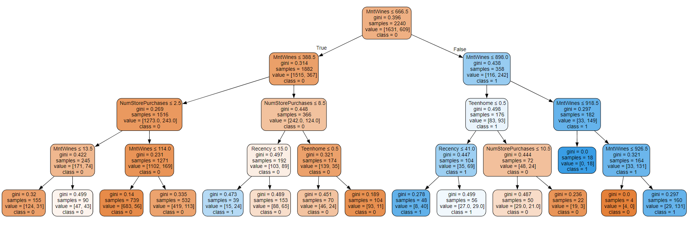

# Análisis de campaña de Marketing

  

## 📋 Índice
1. [Descripción del Proyecto](#descripcion-del-proyecto)
2. [Tecnologías Utilizadas](#tecnologias-utilizadas)
3. [Camino de los Datos](#camino-de-los-datos)
4. [Resultados y Conclusiones](#resultados-y-conclusiones)
5. [Notas Adicionales](#notal-adicionales)

---

## 📌 1. Descripción del Proyecto
**Marketing Campaign Analysis** utiliza Python y bibliotecas avanzadas para analizar el impacto de campañas de marketing, detectando clientes receptivos y proponiendo mejoras basadas en datos históricos. Integra ETL, machine learning y visualización.

---

## 🛠️ 2. Tecnologías Utilizadas

| **Tecnología**      | **Descripción**                                                      | **Tipo**            |
|----------------------|----------------------------------------------------------------------|---------------------|
| **Python**           | Lenguaje principal para procesamiento y análisis.                  | Lenguaje de Programación |
| **Pandas**           | Manejo y transformación de datos tabulares.                        | Biblioteca          |
| **Scikit-learn**     | Creación de modelos predictivos y evaluación.                      | Biblioteca          |
| **Statsmodels**      | Modelos estadísticos como regresión logística.                     | Biblioteca          |
| **Graphviz**         | Visualización de árboles de decisión.                              | Biblioteca          |

---

## 🔄 3. Camino de los Datos

### Proceso ETL
| **Etapa**          | **Descripción**                                                      |
|---------------------|----------------------------------------------------------------------|
| **Extracción**      | Carga inicial del archivo `marketing_data.csv` en Pandas.           |
| **Transformación**  | Limpieza, creación de columnas derivadas (`Engaged`), y estandarización de datos. Obtención de variables con mayor predictividad |
| **Carga**           | Obtención de árbol de decisión y resultados de la campaña. Generación de reportes              |

### Modelo Predictivo
1. **Regresión Logística**: Identificación de variables significativas con `statsmodels`.
2. **Árbol de Decisión**: Clasificación de clientes receptivos usando `Scikit-learn`.

### Generación de Reportes
- Salida visual del árbol con `Graphviz`.
- Resultados consolidados en un archivo `.docx` y gráficos guardados como `.png`.

---

## 📊 4. Resultados y Conclusiones

### Variables Clave
- **Teenhome**, **Recency**, **MntWines**, **NumStorePurchases** son las más influyentes (p < 0.05).

### Tipos de Clientes que aceptaron nuestras ofertas.
| **Tipo de Cliente** | **MntWines**       | **Recency** | **NumStorePurchases** | **Teenhome** |
|----------------------|--------------------|-------------|------------------------|--------------|
| Cliente 1           | 388.5 - 666.5     | < 15        | < 8                   | No           |
| Cliente 2           | 666.5 - 898.5     | < 41        | -                     | No           |
| Cliente 3           | > 926.5           | -           | -                     | No            |
| Cliente 4           | 666.5 - 898       | > 41        | -                     | No           |

- Teenhome: Número de adolescentes en el hogar del cliente.

- Recency: Número de días desde la última compra.

- MntWines:  Cantidad de vino consumido en los últimos dos años.

- NumStorePurchases: Número de compras realizadas directamente en la tienda.

### Árbol de decision.

  

Las hojas que llegan a "class = 1" son los clientes que tienen una alta probabilidad de compra a raíz de nuestras campañas de marketing.
---

## 📘 5. Notas Adicionales

### Índice de Gini
- **Definición**: Mide la pureza de los nodos en árboles de decisión.
- **Valores**: 0 (nodos puros), hasta ~0.5 (división equitativa).
- **Impacto**: Valores bajos implican mejor segmentación y predicción.

### 🚀 Mejoras Futuras
- **Integración con AWS**: Almacenamiento en S3 y procesamiento con Lambda.
- **Automatización**: Implementar workflows automáticos.
- **Visualización Avanzada**: Gráficos interactivos con Plotly o Dash.
- **Clusterización**: Implementar K-Means para segmentación avanzada.
- **API REST**: Desarrollar una API con Django REST Framework para consumir resultados.

